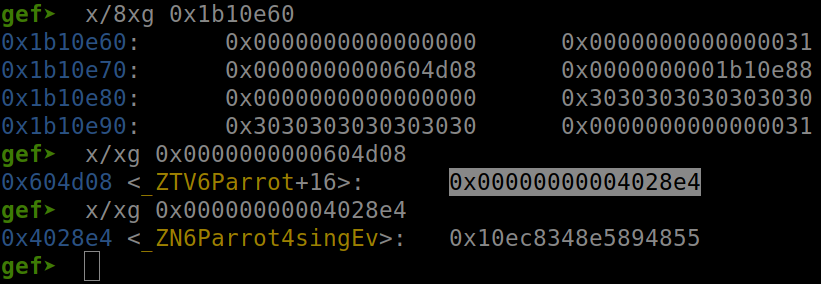

# mocsctf2022.mocsctf.com Cage

Origin challenge link: https://mocsctf2022.mocsctf.com/challenges

You can also download challenge in my repo: [birdcage.zip](birdcage.zip)

There will be 2 file in zip:

- birdcage

- libc-2.27.so

Download the zip and use `patchelf` or `pwninit` to patch file and we start!

# 1. Find bug

First, we use `file` to check for basic information:

```
$ file birdcage

birdcage: ELF 64-bit LSB executable, x86-64, version 1 (SYSV), dynamically linked, interpreter /lib64/ld-linux-x86-64.so.2, for GNU/Linux 3.2.0, BuildID[sha1]=815b314e9a5ce8c0a93ad5878bf245b34e255955, not stripped
```

Well this is a 64-bit file without being stripped. Next we will use `checksec` to check all the defenses:

```
$ checksec birdcage
    Arch:     amd64-64-little
    RELRO:    Partial RELRO
    Stack:    Canary found
    NX:       NX enabled
    PIE:      No PIE (0x400000)
```

Well we can see that `No PIE` will help us a lot. Let's fire up ghidra and get the flow of the program. Because this is a c++ file so most function will be different from c. There are several functions and we will get through all of them shortly.

Firstly, there is a global variable named `cage`.

Secondly, main() will print out the menu, then read in the command, just the command because cin will stop when it meet null byte and space (5 commands are `capture`, `sing`, `dismiss`, `list` and `leave`). After read the command, it will jump to the corresponding function.

Thirdly, capture() will get input of index and name of bird (such as `cock`, `owl` and `parrot`). After getting input, it will check if `cage[index]` is null or not. If not null, it will free() at position correspond to index. 

After that, it will `operator.new()` which similar to malloc(). Cock and Owl will malloc with constant string while parrot will malloc and get string from our input. One thing to notice is that `cin` in parrot will get unlimited input --> **Heap Buffer Overflow**

```
// Address: 0x0000000000402848
void __thiscall Parrot::Parrot(Parrot *this)

{
	char *pcVar1;

	// Inherit of bird
	Bird::Bird((Bird *)this);
	
	// Add parrot:sing address to chunk
	*(undefined ***)this = &PTR_sing_00604d08;

	// Add buffer address
	// buffer address = curent heap address + 0x18
	std::__cxx11::basic_string<char,std::char_traits<char>,std::allocator<char>>::basic_string
			((basic_string<char,std::char_traits<char>,std::allocator<char>> *)(this + 8));

    // cout << "Pls talk: ";
    std::operator<<((basic_ostream *)std::cout,"Pls talk: ");
    
    // Get the buffer
    pcVar1 = (char *)std::__cxx11::basic_string<char,std::char_traits<char>,std::allocator<char>>::
			data((basic_string<char,std::char_traits<char>,std::allocator<char>> *)(this + 8)
                       );

    // cin >> pcVar1;
	std::operator>>((basic_istream *)std::cin,pcVar1);
	return;
}
```

When look at GDB, it will be like this:


With unlimited input, we can overwrite all the next heap to do whatever we want. And one more thing we need to know that cin will auto add null byte at the end of input.

The forth function is sing, which will **execute** function sing of the correspond bird. Remember that it take the address from heap, then execute the address in it. For example as below:



The address `0x0000000000604d08` contains parrot::sing address `0x00000000004028e4`. As the result, it will execute `0x00000000004028e4`, not `0x0000000000604d08`.

The fifth function is dismiss, which will free() the chunk and set `cage[index]=0` so there is no use after free.

- Summary all bugs:

  1. Heap Buffer Overflow

  2. cin will auto add null byte at the end of user input

  3. Sing() will execute function inside a parent address

  4. Sing() will print out the data until null byte or space

  5. `cage` is a global variable

# 2. Idea

We know that we have heap buffer overflow, with which we can do arbitrary write and Sing() will print out data for us. The first thing we are going to do is leak the heap and libc address via `cage` (`cage` is global var so address will be the same because of `No PIE`) and `@got` (I will use `alarm@got`)

With address of libc and heap, we can make it Sing() to execute libc function which create shell for us. But after I did, I realize we also need to leak stack address. From leaked stack address, we will calculate the return address of main, then arbitrarily write to return and we get shell.

- Summary:

  1. Leak heap address

  2. Leak libc address

  3. Leak stack address

  4. Get shell

# 3. Exploit

Table of content:

  1. Leak heap address

  2. Leak libc address

  3. Leak stack address

  4. Get shell

---

We will makes some functions to help us exploit more convinient:

<details>
<summary>Code snippet</summary>
<p>

```
def capture(index, bird, talk=''):
	data = 'capture ' + str(index) + ' ' + bird
	p.sendlineafter(b'>', data.encode())
	if bird=='parrot':
		p.sendlineafter(b'Pls talk:', talk)

def sing(index):
	p.sendlineafter(b'>', 'sing {}'.format(index).encode())
	return p.recvuntil(b'>')

def dismiss(index):
	p.sendlineafter(b'>', 'dismiss {}'.format(index).encode())

def list():
	p.sendlineafter(b'>', b'list')

def leave():
	p.sendlineafter(b'>', b'leave')
```

</p>
</details>

And now let's start

### Stage 1: Leak heap address

We know that Sing() will execute function inside `0x0000000000604d08` and print data of the next 8-byte address