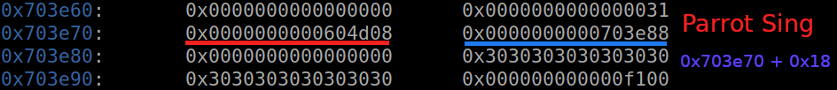

# mocsctf2022.mocsctf.com Cage

Origin challenge link: https://mocsctf2022.mocsctf.com/challenges

You can also download challenge in my repo: [birdcage.zip](birdcage.zip)

There will be 2 file in zip:

- birdcage

- libc-2.27.so

Download the zip and use `patchelf` or `pwninit` to patch file and we start!

# 1. Find bug

First, we use `file` to check for basic information:

```
$ file birdcage

birdcage: ELF 64-bit LSB executable, x86-64, version 1 (SYSV), dynamically linked, interpreter /lib64/ld-linux-x86-64.so.2, for GNU/Linux 3.2.0, BuildID[sha1]=815b314e9a5ce8c0a93ad5878bf245b34e255955, not stripped
```

Well this is a 64-bit file without being stripped. Next we will use `checksec` to check all the defenses:

```
$ checksec birdcage
    Arch:     amd64-64-little
    RELRO:    Partial RELRO
    Stack:    Canary found
    NX:       NX enabled
    PIE:      No PIE (0x400000)
```

Well we can see that `No PIE` will help us a lot. Let's fire up ghidra and get the flow of the program. Because this is a c++ file so most function will be different from c. There are several functions and we will get through all of them shortly.

Firstly, there is a global variable named `cage`.

Secondly, main() will print out the menu, then read in the command, just the command because cin will stop when it meet null byte and space (5 commands are `capture`, `sing`, `dismiss`, `list` and `leave`). After read the command, it will jump to the corresponding function.

Thirdly, capture() will get input of index and name of bird (such as `cock`, `owl` and `parrot`). After getting input, it will check if `cage[index]` is null or not. If not null, it will free() at position correspond to index. 

After that, it will `operator.new()` which similar to malloc(). Cock and Owl will malloc with constant string while parrot will malloc and get string from our input. One thing to notice is that `cin` in parrot will get unlimited input --> `Heap Buffer Overflow`

```
// Address: 0x0000000000402848
void __thiscall Parrot::Parrot(Parrot *this)

{
	char *pcVar1;
  
	Bird::Bird((Bird *)this);
	
	// 
	*(undefined ***)this = &PTR_sing_00604d08;
	std::__cxx11::basic_string<char,std::char_traits<char>,std::allocator<char>>::basic_string
			((basic_string<char,std::char_traits<char>,std::allocator<char>> *)(this + 8));

    // cout << "Pls talk: ";
    std::operator<<((basic_ostream *)std::cout,"Pls talk: ");
    
    // Get the current heap address + 0x18 = pcVar1
    pcVar1 = (char *)std::__cxx11::basic_string<char,std::char_traits<char>,std::allocator<char>>::
			data((basic_string<char,std::char_traits<char>,std::allocator<char>> *)(this + 8)
                       );

    // cin >> pcVar1;
	std::operator>>((basic_istream *)std::cin,pcVar1);
	return;
}
```

When look at GDB, it will be like this:



And with unlimited input, we can overwrite all the next heap to do whatever we want.

The forth function is sing, which will take 